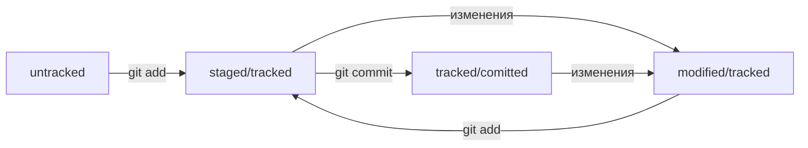

# Этот проект создан чтобы помочь запомнить основные команды для работы с git и github


## Инициализируем репозиторий
- инициализировать репозиторий можно с помощью команды `git init`
- проверить статус, или состояние, репозитория поможет команда `git status`
- если вы ошиблись и случайно инициализировали не ту папку, можно «разгитить» её — удалить скрытую подпапку `.git`
---
## Статусы файлов в Git (основные)
- untracked - неотслеживаемый 
- staged - подготовленный. После выполнения команды `git add`
- tracked - отслеживаемый. Untracked становится tracked после выполнения команды `git add`
- modified - изменённый. Состояние modified означает, что Git сравнил содержимое файла с последней сохранённой версией и нашёл отличия.

#### Жизненный цикл файла в Git



---
## Добавляем файлы в репозиторий
- команда `git add` позволяет подготовить файл к сохранению
- команда `git add --all` подготовит к сохранению сразу все файлы
- с помощью `git add .` можно добавить в репозиторий текущую папку, что идентично команде `git add --all`
---
## Делаем первый коммит
- коммит можно сделать с помощью команды `git commit`
- ключ `-m` позволяет присвоить коммиту сообщение
- существуют разные подходы к описанию коммита, но все они включают в себя эти принципы: 
    *сообщение коммита легко читается;
    *оно информативное;
    *все сообщения оформлены в одном стиле.
---
## Просматриваем историю коммитов (лог)
- используйте команду `git log` чтобы посмотреть сделанные ранее коммиты
- используй флаг `--oneline` чтобы получить сокращённый лог. В терминале появятся только первые несколько символов хеша каждого коммита и их комментарии.
---
## Из чего состоит лог
#### Хеш - строка из цифр и латинских букв после слова commit
- у каждого коммита есть свой отпечаток (хеш), который формируется из информации о коммите (когда был сделан коммит, содержимое файлов в репозитории на момент коммита и ссылка на предыдущий, или родительский, коммит)
- хеш это короткая 40 символьная строка состоящая из цифр 0—9 и латинских букв A—F выглядит так `4cd09ab380cefcffe1e6929c8c33e1bb4a2c27e0`, любое изменение в информацию о коммите изменит хеш до неузноваемости 
- хеш это основной идентификатор комита и позволяет узнать его автора, дату и содержимое закоммиченных файлов
#### Author — имя автора и его электронная почта
#### Date — дата и время создания коммита
#### в конце находится сообщение коммита 
---
## HEAD
- HEAD - один из служебных файлов папки `.git`. Он указывает на коммит, который сделан последним 
- внутри HEAD - ссылка на служебный файл. Если заглянуть в этот файл, можно увидеть хеш последнего коммита
- слово HEAD можно использовать вместо хеша последнего коммита
---
## Генерируем SSH-ключ
SSH протокол обеспечивает безопасный обмен данными. Тот у кого будет публичный ssh ключ может может отправлять зашифрованную им информацию расшифровать которую сможете только вы своим приватным ключом (без расширения .pub).  
Именно поэтому нельзя ни с кем делиться приватным shh ключом, иначе все ваши секреты будут расшифрованы не вами.
- проверяем есть ли у вас уже такой ключ командой:
``` bush
ls -la .ssh/ # вывели список созданных ключей 
```
- если уже есть ключ который вы создавали то следующие шаги этого раздела можно пропустить
- для генерации ключа ssh используем такую команду:
``` bush
ssh-keygen -t ed25519 -C "электронная почта, к которой привязан ваш аккаунт на GitHub"
```
- в результате будет сгенерировано 2 ключа приватный и публичный с расширением `.pub`
---
## Привязываем SSH-ключ к GitHub
- копируем сгенерированный на предыдущем шаге публичный shh ключ с расширением `.pub` в буфер обмена (либо если был до этого, то копируем тот который был)
- переходим в github > настройки пользователя (иконка пользователя > settings)
- в меню слева нажимаем на пункт SSH and GPG keys
- в открывшейся вкладке выбираем New SSH key
- в поле Title пишем название ключа. Например, Personal key
- в поле Key type должно быть Authentication Key
- в поле Key вставляем ваш ключ из буфера обмена
- нажимаем на кнопку Add SSH key
- теперь ваш ключ привязан к GitHub
---
## Связываем локальный и удалённый репозитории
- перейдите на страницу удалённого репозитория, выберите тип SSH и скопируйте URL
- откройте консоль, перейдите в каталог локального репозитория и введите команду `git remote add`
- команде необходимо передать два параметра: имя удалённого репозитория и его URL. В качестве имени используйте слово origin. А URL вы скопировали со страницы удалённого репозитория
``` bush
git remote add origin git@github.com:%ИМЯ_АККАУНТА%/first-project.git 
```
- убедитесь что репозитории связаны с помощью команды 
``` bush
git remote -v
```
---
## Синхронизируем локальный и удалённый репозитории
-загружаем содержимое локального репозитория в удаленный с помощью команды:
``` bush
git push -u origin master
```
- зайдите в удаленный репозиторий на GitHub. Вы увидите, что в репозитории появились файлы с изменениями
- в дальнейшем при работе с удалённым репозиторием флаг `-u` можно опустить и писать просто git push